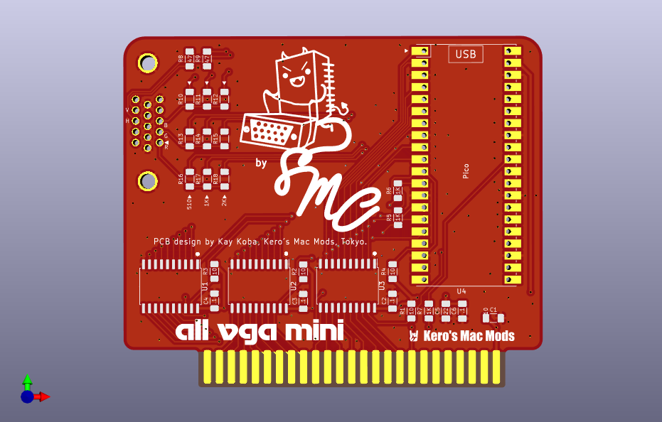

# A][ VGA MINI Card

PCBs smaller than 100x100mm can often be made cheaply, so I tried configuring a small board with SMD parts. It's still in the prototyping stage.  
  

- Small size within 100x100mm 
- Uses cheap SMD parts, they are as large as possible, making the soldering process painless. 
- Short size economy db15 connectors can be used. 

