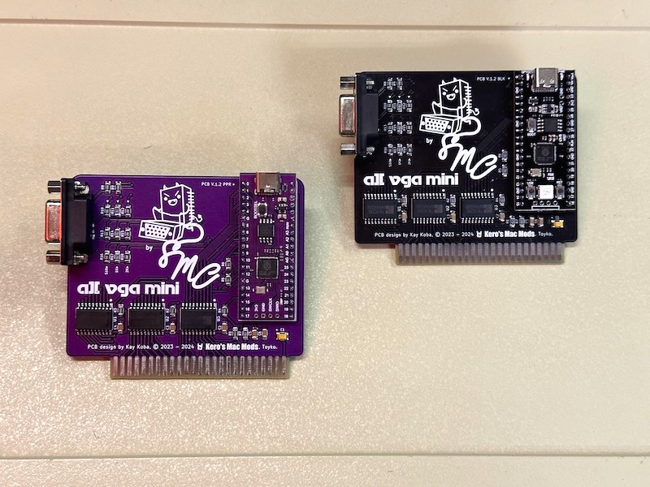

# AII VGA MINI Card

 
Our board concept is to provide inexpensive graphics cards to enthusiasts, not home brewing, so we used a lot of SMD parts that people who like soldering their own don't like. We have prepared two types: Purple and Black.
Although we named it "mini", it's actually not extremely small, but since PCB companies can make it cheaply within 100x100mm, we made it small accordingly. We are proud that it has excellent cost performance and has a cool and luxurious feel. Purple card is still in the prototyping stage, because this pinout is different from regular Pico boards, to have more address pins.   
  

- Small size within 100x100mm, This is the size for which the PCB company's economy rates apply. 
- Uses cheap SMD parts, they are as large as possible, by maximizing the 1.27 pitch ICs, solder defects are less likely to occur at the factory. 
- Short size db15 connectors can be used. 
- Used clone Pi Pico boards, black and purple they look badass... 
- Equipped with a 3.3V regulator that generates less heat. 
- Fun artwork by Drake.

  

## For other information

### Gerber and soldering work

We have [Gerber](Gerber_GH) to make this Black VGA card, Raspberry Pi Pico board matches with genuine pinouts.　[Here](A2VGA_BLK_BOM.xlsx) is BOM. Gerber's silkscreen has been modified. This is because the artwork is copyrighted by Drake. Furthermore, since we are not only enthusiast developer but also have to run our own store, we have a CC BY-NC-SA 4.0 license. You can create it for free if you want to use it.  
If SMD soldering is difficult your own, we think another fork of [Briel's version](https://github.com/retrotink/Apple-II-VGA) is easier to assemble. We refering to their version for the circuit configuration of the buffer transceivers.  

### Install the firmeware, Replace is also easy

Now, A2 VGA team has new firmware [V1.2](https://github.com/markadev/AppleII-VGA/releases/tag/v1.2.0), since it has already been compiled, it can be treated as a ".uf2" file.  

If you want to change the Apple IIe firmware to IIPlus or vice versa, replacing firmware is easy. Hold down the "BOOT" switch on the PICO board on this card and connect a new computer via USB Type-C, it will appear as a removable media folder on your desktop. Drag and drop any .uf2 file here. The folder that appeared will be unmounted. Flashing is now complete. Available on Windows and Mac.  

If you want to compile the program yourself, you can set it up by following the article [here](https://github.com/markadev/AppleII-VGA/tree/main/pico).

### Sold at Kero's Mac Mods Store *Early February 2024
  
It will be sold 50 USD in our store.  
https://en.infinityproducts.co.jp/shop-1

## License

This AII VGA MINI Card hardware is licensed under a CC BY-NC-SA 4.0 
  
Since we are running a [store](https://en.infinityproducts.co.jp/shop-1), we would like to handle the sales under our control. Our designs are open source and free for enthusiasts to create their own. However, sales are not allowed. Thank you for your understanding.

The original AppleII-VGA has an [MIT](https://github.com/markadev/AppleII-VGA/blob/main/LICENSE) license, follow their policies.

## Thanks to the original developer of this card

We were a latecomer to this card design, but many designers had already created forked cards.  
A big thanks to Mark Aikens (Aka, markadev), the original inventor. And thank you to all the like-minded Geeks!  

Ⓒ 2023 Kay Koba, Kero's mac Mods, All rights reserved. 

